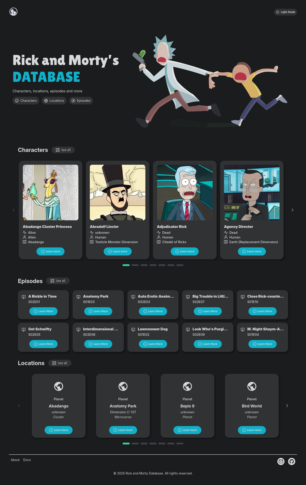
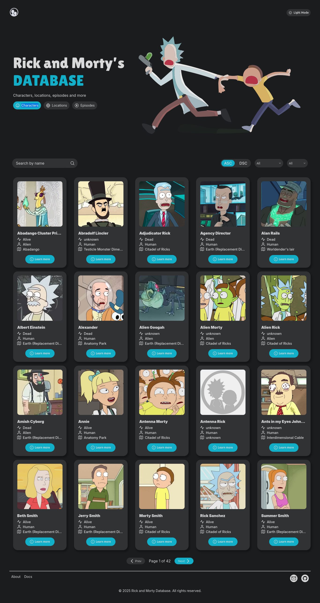
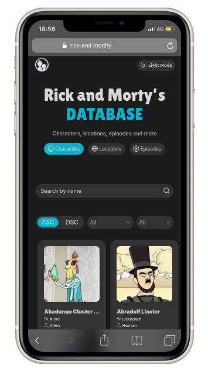

<div align="center">
    
</div>

<div align="center">

[](https://angular.io/)
[](https://www.typescriptlang.org/)
[](LICENSE)
[](https://rxjs.dev/)
[](https://primeng.org/)

</div>

> _A modern Angular application to explore the infinite multiverse of Rick and Morty!_

A comprehensive web interface built with Angular that provides an intuitive way to browse and explore the Rick and Morty universe. The application consumes the [Rick and Morty API](https://rickandmortyapi.com) to deliver rich information about characters, locations, episodes, and more.

## 🚀 Demo

[Live Web](https://rick-and-morthy-client.vercel.app/) | [Screenshots](#screenshots)

## 📋 Table of Contents

- [Features](#-features)
- [Demo](#-demo)
- [Tech Stack](#-tech-stack)
- [Getting Started](#-getting-started)
  - [Prerequisites](#prerequisites)
  - [Installation](#installation)
  - [Development Server](#development-server)
  - [Build](#build)
- [Project Structure](#-project-structure)
- [API Integration](#-api-integration)
- [Environment Configuration](#-environment-configuration)
- [Screenshots](#-screenshots)
- [Features Roadmap](#-features-roadmap)
- [Contributing](#-contributing)
- [Support](#-support)
- [License](#-license)
- [Acknowledgments](#-acknowledgments)

## 📖 Overview

Rick and Morty Explorer is a comprehensive front-end application that provides an intuitive interface for exploring all aspects of the Rick and Morty universe. Users can browse characters, locations, and episodes with rich filtering capabilities and an immersive user experience.

## ✨ Features

- **Character Explorer**

  - Browse all characters with pagination
  - Filter by status (alive, dead, unknown)
  - Filter by species, gender, and origin
  - Detailed character profiles

- **Location Directory**

  - Browse all locations from the multiverse
  - Filter by type and dimension

- **Episode Guide**

  - Complete episode listing with air dates
  - Season categorization

- **User Experience**
  - Responsive design for mobile and desktop
  - Dark/Light theme toggle
  - Intuitive navigation with hero section
  - Dynamic search capabilities
  - Consistent theming inspired by the show
  - Loading states and error handling

## 🛠 Tech Stack

- **Frontend Framework:** Angular 19.2.0
- **Language:** TypeScript 5.7
- **UI Components:** PrimeNG 19.1.2
- **Icons:** PrimeIcons 7.0.0
- **Styling:** SCSS with responsive design
- **State Management:** RxJS for reactive state handling
- **HTTP Client:** Angular HttpClient for API communication
- **Build Tools:** Angular CLI
- **Package Manager:** npm

## 🚀 Getting Started

### Prerequisites

Make sure you have the following installed on your development machine:

- **Node.js** (v18 or higher) - [Download](https://nodejs.org/)
- **npm** (comes with Node.js) or **yarn** package manager
- **Angular CLI** (optional but recommended) - `npm install -g @angular/cli`

### Installation

1. **Clone the repository:**

   ```bash
   git clone https://github.com/brunoliratm/RickAndMorthy-Client.git
   ```

2. **Navigate to the project directory:**

   ```bash
   cd RickAndMorthy-Client
   ```

3. **Install dependencies:**
   ```bash
   npm install
   ```

### Development Server

Start the development server:

```bash
npm start
# or
ng serve
```

Open your browser and navigate to `http://localhost:4200`. The application will automatically reload if you change any of the source files.

### Build

Build the project for production:

```bash
npm run build
# or
ng build
```

The build artifacts will be stored in the `dist/` directory.

## 📁 Project Structure

```
src/
├── app/
│   ├── core/
│   │   ├── config/
│   │   ├── models/
│   │   └── services/
│   ├── features/
│   │   ├── characters/
│   │   ├── episodes/
│   │   ├── home/
│   │   └── locations/
│   ├── shared/
│   │   └── components/
│   ├── app.component.*
│   ├── app.routes.ts
│   └── main.ts
```

## 🔌 API Integration

The application integrates with the [Rick and Morty API](https://rickandmortyapi.com) to fetch data about:

- **Characters:** `/character` endpoint with filtering capabilities
- **Locations:** `/location` endpoint with type and dimension filters
- **Episodes:** `/episode` endpoint with season information

### API Services

Each API service is implemented in the `core/services` directory with TypeScript interfaces for strong typing:

- `CharacterService` - Handles character data fetching and filtering
- `LocationService` - Manages location data and resident information
- `EpisodeService` - Handles episode data and character appearances

### Data Models

Type-safe interfaces are defined in `core/models/`:

- `Character` - Character data structure
- `Location` - Location data structure
- `Episode` - Episode data structure
- `ApiInfo` - API pagination information

## ⚙️ Environment Configuration

The application uses environment configuration for API endpoints:

```typescript
// src/app/core/config/environment.ts
export const environment = {
  apiBaseUrl: "https://rickandmortyapi.com/api",
};
```

## 📱 Screenshots

### Screenshots

<div align="center">
  <details>
    <summary>Home Page</summary>
    
    <p><em>Home page with hero section and navigation</em></p>
  </details>

  <details>
    <summary>Character List</summary>
    
    <p><em>Character browser with filtering options</em></p>
  </details>

  <details>
    <summary>Mobile View</summary>
    
    <p><em>Responsive design for mobile devices</em></p>
  </details>
</div>

## 🤝 Contributing

Contributions are welcome! Please feel free to submit a Pull Request. For major changes, please open an issue first to discuss what you would like to change.

### Development Guidelines

1. **Fork the repository**
2. **Create your feature branch:**
   ```bash
   git checkout -b feature/amazing-feature
   ```
3. **Commit your changes:**
   ```bash
   git commit -m 'Add some amazing feature'
   ```
4. **Push to the branch:**
   ```bash
   git push origin feature/amazing-feature
   ```
5. **Open a Pull Request**

### Code Style

- Follow Angular style guide conventions
- Use TypeScript strict mode
- Write meaningful commit messages
- Add tests for new features
- Update documentation as needed

## 📞 Support

If you have any questions or need help with the project:

- **Issues:** [GitHub Issues](https://github.com/brunoliratm/RickAndMorthy-Client/issues)

## 📄 License

This project is licensed under the MIT License - see the [LICENSE](LICENSE) file for details.

## 🙏 Acknowledgments

- **Rick and Morty API** - [https://rickandmortyapi.com](https://rickandmortyapi.com) for providing the comprehensive API
- **Angular Team** - For the excellent framework and development tools
- **PrimeNG** - For the beautiful UI components
- **Open Source Community** - For the amazing tools and libraries

---

<div align="center">
  Made with ❤️ for Rick and Morty fans everywhere
</div>
